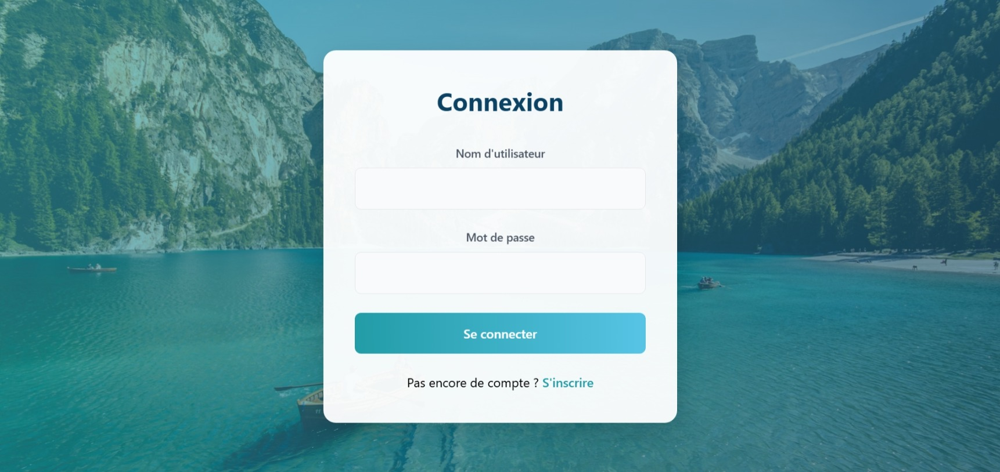

# 🌍 Planificateur de Voyages Interactif

Un projet full-stack pour la **planification intelligente et interactive de voyages**, développé avec **React (Frontend)** et **Spring Boot (Backend)**.  
Ce projet permet de gérer des voyages, d’ajouter des utilisateurs et d’interagir avec une base de données via une API sécurisée.

---

## 🚀 Fonctionnalités

-  **Authentification & sécurité** (Spring Security, JWT)
-  Gestion des utilisateurs
-  Gestion des voyages (ajout, modification, suppression, consultation)
-  API REST entre le backend et le frontend
-  Interface moderne avec **React + TailwindCSS**
-  Persistance des données avec **MySQL**

---

